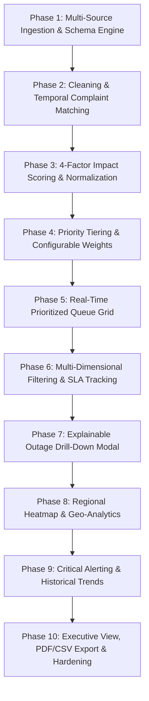

# OutageIQ — Network Outage Impact Prioritization Platform

> **AI-Powered & Telemetry-Driven Network Outage Prioritization Dashboard**  
> *Unifying Network Outages, CRM Complaints, and ERP Demographic Signals into an Explainable, Role-Tailored Operational Platform*  
> **Team:** The NOC Squad (**Bhawana Kumari** & **Karan Devgan**)  
> **Documentation Directory:** [`docs/`](docs/)

---

## 1. Executive Summary & Problem Statement

Modern telecommunications network operations teams are inundated daily with three disparate, siloed data streams:
1. **Network Outage Alarms (NOC):** Technical alarms, fiber link breaks, switch hardware faults, and severity codes.
2. **Customer Complaint Logs (CRM):** Inbound calls, mobile app tickets, web chat escalation, and social media velocity.
3. **Regional Demographic & Usage Metrics (ERP):** Regional subscriber volumes, daily data/voice traffic, and revenue tiers.

### The Operational Problem
When these three data streams operate in silos, Network Operations Engineers triage incidents using static severity codes or gut feel. As a result:
- **Severe business disruptions are deprioritized:** A localized fiber cut impacting 50,000 subscribers in a Tier-1 revenue hub may sit behind a low-impact core alert with an inflated severity flag.
- **SLA penalties and customer churn escalate:** Preventable churn spikes in high-value metropolitan circles.
- **Leadership lacks unified visibility:** Executive stakeholders lack a real-time, explainable view of "what is broken, why it matters, and the total revenue at risk."

### The OutageIQ Solution
**OutageIQ** ingests, cleans, validates, and spatio-temporally fuses all three data streams into a unified data model. It computes a mathematically rigorous, transparent **0–100 Composite Impact Score**, categorizes incidents into operational priority tiers, tracks real-time SLA breach countdowns, and serves tailored, role-guarded dashboards for every tier of the telecommunications enterprise.

```
┌──────────────────────────────────────────────────────────────────────────────────────────┐
│                                 1. SOURCE TELEMETRY                                      │
│  outage_alerts.csv (NOC)   │   complaint_logs.csv (CRM)   │ region_usage_metrics.csv (ERP)│
└────────────────────────────┬──────────────────────────────┴──────────────────────────────┘
                             │
                             ▼
┌──────────────────────────────────────────────────────────────────────────────────────────┐
│                             2. PYTHON ANALYTICS ENGINE                                   │
│  • ingestion.py          : CSV/JSON intake, schema validation, data deduplication        │
│  • ingestion.py (match)  : Spatio-temporal complaint fusion (±2.0h sliding window)       │
│  • scoring.py            : Vectorized 4-factor min-max relative score calculator (0-100) │
│  • queue_manager.py      : Multi-key deterministic priority ranking & tie-breaker        │
│  • geo_analytics.py      : Demographic circle aggregation, density & revenue exposure    │
│  • trend_analytics.py    : 7-day rolling window, MTTR tracking, breach escalation alarms  │
│  • reporting.py          : SLA threshold countdowns, PDF/CSV report generation           │
└────────────────────────────┬─────────────────────────────────────────────────────────────┘
                             │
                             ▼
┌──────────────────────────────────────────────────────────────────────────────────────────┐
│                             3. SQLITE DATABASE ENGINE                                    │
│                     Embedded Storage: backend/data/outageiq.db                           │
│  • outages table         : 22 attributes (ID, scores, 4 sub-scores, SLA timers, cause)   │
│  • regions table         : 10 attributes (subscribers, tier, active count, compliance)   │
│  • complaints table      : 7 attributes (complaint ID, timestamps, channels, match tags) │
└────────────────────────────┬─────────────────────────────────────────────────────────────┘
                             │
                             ▼
┌──────────────────────────────────────────────────────────────────────────────────────────┐
│                   4. UNIFIED SINGLE-SERVER REST API (PORT 8000)                          │
│  GET  /api/health            GET  /api/outages             GET  /api/outages/<id>        │
│  GET  /api/regions           GET  /api/analytics           GET  /api/executive-summary   │
│  GET  /api/export/csv        GET  /api/export/pdf          POST /api/recalculate         │
│  POST /api/outages/<id>/escalate                           POST /api/outages/<id>/assign │
└────────────────────────────┬─────────────────────────────────────────────────────────────┘
                             │ Live REST JSON Streaming & RBAC Route Protection
                             ▼
┌──────────────────────────────────────────────────────────────────────────────────────────┐
│                   5. PRODUCTION UI ROUTES (http://localhost:8000)                        │
│  • http://localhost:8000/overview  : Live KPIs, circular SVG gauge, sub-scores, trends   │
│  • http://localhost:8000/queue     : Ranked deterministic queue, region filter, escalate │
│  • http://localhost:8000/regions   : Circle matrix, bar chart, "Filter Queue by Region"  │
│  • http://localhost:8000/analytics : 2x2 multi-chart grid, weekly briefing, top 5 outages│
│  • http://localhost:8000/export    : 3 export cards, tabular queue, CSV/PDF downloads    │
└──────────────────────────────────────────────────────────────────────────────────────────┘
```

---

## 2. Core Product Goals & Key Performance Indicators (PRD Section 3 & 10)

| Goal ID | Product Goal | Architecture & Implementation | PRD Target KPI |
| :--- | :--- | :--- | :--- |
| **G1** | **Unify Signal** | Modular CSV/JSON ingestion pipeline merging outage alerts, CRM complaint logs, and regional demographics. | 100% schema validation & deduplication |
| **G2** | **Quantify Impact** | Vectorized 4-factor Min-Max normalized mathematical formulation (0–100 Impact Score). | Zero black-box scoring; 4 sub-scores exposed |
| **G3** | **Prioritize Action** | Deterministic multi-key priority queue sorting open incidents by Impact Score descending. | Top-impact incident in slot #1 |
| **G4** | **Reduce Time-to-Triage** | Direct 1-click tactical escalation buttons and instant regional filtering. | $\ge 30\%$ reduction in Time-to-Triage |
| **G5** | **Enable Leadership Reporting** | 7-day rolling trend lines, executive Top-5 summaries, and RFC-1.4 binary PDF downloads. | 1-click boardroom PDF generation |

---

## 3. Four User Personas & Role-Based Access Control (RBAC) Guide

OutageIQ enforces strict **Role-Based Access Control (RBAC)**. Users authenticate at `/login` using dedicated credentials or 1-click demo personas. Unauthorized route access is intercepted by the client-side **`RoleGuard`** and met with a **`403 Forbidden — Role Access Restricted`** security screen.

```
┌──────────────────────────────────────────────────────────────────────────┐
│ 🚨 403 FORBIDDEN — ROLE ACCESS RESTRICTED                                │
│ Access Denied: Executive PDF Incident Briefings                          │
│ Requested URL: /export                                                   │
│ Logged In User: Rahul K. [NOC Engineer] (ID: rahul.noc)                  │
│ Policy: Board-level PDF report generation is restricted to Leadership.   │
│ [ ← Return to Your Authorized Dashboard (Outage Queue) ]                 │
└──────────────────────────────────────────────────────────────────────────┘
```

### RBAC Quick Reference Table

| User Persona | Dummy User ID | Password | Job Role & Focus | Primary Dashboard | Authorized Routes | Restricted Routes |
| :--- | :--- | :--- | :--- | :--- | :--- | :--- |
| **Rahul K.** | `rahul.noc` *(or `rahul`)* | `noc@123` | **NOC Engineer**<br>*(Live Triage & Immediate Fixes)* | `/queue`<br>*(Outage Queue)* | `/queue`<br>`/overview`<br>`/` | `❌ /analytics`<br>`❌ /regions`<br>`❌ /export` |
| **Priya S.** | `priya.ops` *(or `priya`)* | `ops@123` | **Regional Ops Manager**<br>*(Circle Density & SLA Compliance)* | `/regions`<br>*(Region View)* | `/regions`<br>`/queue`<br>`/overview`<br>`/` | `❌ /analytics`<br>`❌ /export` |
| **Farah C.** | `farah.cx` *(or `farah`)* | `cx@123` | **Customer Experience Lead**<br>*(Hourly Complaints & Proactive Comms)* | `/analytics`<br>*(CX Hub)* | `/analytics`<br>`/overview`<br>`/` | `❌ /regions`<br>`❌ /queue` *(tech actions)*<br>`❌ /export` |
| **Vikram D.** | `vikram.exec` *(or `vikram`)* | `exec@123` | **Leadership / Director**<br>*(Macro Trends, Revenue at Risk & PDF Reports)* | `/analytics`<br>*(Exec Summary)* | `/analytics`<br>`/export`<br>`/regions`<br>`/overview`<br>`/` | `❌ /queue` *(tactical tech actions)* |

---

### Detailed Persona Breakdown

#### 1. Rahul K. — NOC Operations Engineer (`rahul.noc` / `noc@123`)
* **Role Summary:** 24/7 front-line incident dispatcher monitoring live alerts across core switches, base stations, and optical fiber transport routes.
* **Primary Dashboard:** `/queue` (`QueueView.tsx`, `LiveQueuePreview.tsx`)
* **UI Features & Interactions:**
  - **Deterministic Ranked Queue:** Live incident table sorted by composite Impact Score (`#1`, `#2`, `#3`).
  - **Tactical Action Bar:** `⚡ Escalate Outage (Dispatch P1 Field Tech)` and `✓ Assign Tier-3 Optical Lead`. Clicking these buttons sends live `POST /api/outages/<id>/escalate` or `POST /api/outages/<id>/assign` requests that permanently update SQLite.
  - **Technical Inspector Drawer:** Full technical breakdown of fiber severances, edge switch ASIC memory failures, 5G carrier aggregation loss, and affected service codes (VoLTE, 5G Data, Leased Lines).
  - **Operational Filters:** Severity code filters (Critical, High, Medium, Low), status toggles (Open, In Progress, Resolved), and Node Search.
  - **Critical Alert Banner (FR16):** Live banner triggering when an incident exceeds the 75.0 critical threshold.
* **Backend Functions & APIs Used:**
  - `scoring.py`: `compute_impact_scores()`, `assign_priority_tier()`, `evaluate_data_confidence()`
  - `queue_manager.py`: `get_prioritized_queue()`
  - `reporting.py`: `add_sla_tracking()`, `filter_outages()`, `calculate_sla_status()`
  - `server.py`: `GET /api/outages`, `GET /api/outages/<id>`, `POST /api/outages/<id>/escalate`, `POST /api/outages/<id>/assign`

#### 2. Priya S. — Regional Operations Manager (`priya.ops` / `ops@123`)
* **Role Summary:** Manages operational health, infrastructure capacity, and SLA compliance across 9 major telecom circles (Mumbai, Delhi NCR, Bangalore, Chennai, Hyderabad, Pune, Kolkata, Ahmedabad, Jaipur).
* **Primary Dashboard:** `/regions` (`RegionsView.tsx`, `RegionalImpactOverview.tsx`)
* **UI Features & Interactions:**
  - **Regional Geo-Operations Command Center:** Circle-by-circle health rankings, active incident counts, and hourly revenue exposure (e.g. ₹45.2 L/hr in Mumbai).
  - **Comparative Horizontal Bar Chart:** Visual ranking of regional revenue at risk and impact score density.
  - **Regional SLA Compliance Dial & Countdowns:** Countdown timers tracking hours remaining before circle SLAs breach.
  - **1-Click "Filter Queue by Region":** Clicking `[ Filter Queue by Mumbai → ]` navigates directly to `/queue?region=Mumbai`, pre-populating filters and executing `GET /api/outages?region=Mumbai`.
* **Backend Functions & APIs Used:**
  - `geo_analytics.py`: `compute_regional_aggregations()`, `get_regional_ranking()`, `_determine_dominant_severity()`, `_determine_density_rating()`
  - `reporting.py`: `filter_outages(region_id=...)`, `add_sla_tracking()`
  - `server.py`: `GET /api/regions`, `GET /api/outages?region=...`

#### 3. Farah C. — Customer Experience Lead (`farah.cx` / `cx@123`)
* **Role Summary:** Protects customer sentiment and brand Net Promoter Score (NPS) during outages, correlates complaint surges with network alarms, and dispatches proactive communications.
* **Primary Dashboard:** `/analytics` (`AnalyticsView.tsx`, `ImpactTrendAnalytics.tsx`)
* **UI Features & Interactions:**
  - **Hourly Inbound Complaint Velocity Graph:** Plots call center and app complaint velocity (06:00 to 22:00) against outage start times.
  - **Interactive Proactive Communication Dispatcher:** Allows Farah to select notification channels (**SMS Gateway**, **Mobile App Push**, **Call Center IVR Deflection**, **Web Banner**), compose incident notices, and simulate 1-click broadcast alerts to impacted subscribers.
  - **Customer Disruption Radar:** Breakdown of affected consumer services (VoLTE voice drops, 5G mobile data, residential fiber).
  - **Linked Complaints Explorer:** Stream of complaints tagged with explicit vs temporal match indicators.
* **Backend Functions & APIs Used:**
  - `ingestion.py`: `match_unlinked_complaints()`, `get_complaint_linkage_summary()`, `read_complaints()`, `merge_datasets()`
  - `trend_analytics.py`: `compute_kpis()`, `compute_rolling_trends()`
  - `server.py`: `GET /api/analytics`

#### 4. Vikram D. — Leadership / Executive Director (`vikram.exec` / `exec@123`)
* **Role Summary:** Directs strategic infrastructure investments, monitors enterprise Revenue at Risk (₹42.3 Cr), reviews macro 7-day volume trajectories, and generates confidential executive PDF briefings.
* **Primary Dashboard:** `/analytics` & `/export` (`AnalyticsView.tsx`, `ExportView.tsx`, `RoiCalculator.tsx`)
* **UI Features & Interactions:**
  - **Executive Operations KPI Ribbon:** Displays Active Outages, MTTR (3h 52m), Revenue at Risk (₹42.3 Cr), and SLA Compliance (84%).
  - **7-Day Rolling Outage Volume & Score Trajectory:** Rolling trend lines comparing current week vs prior week.
  - **Top 5 Highest-Impact Outages Executive Summary Table:** Clean presentation-ready view of top incidents.
  - **1-Click Executive PDF Briefing Generator:** Direct button triggering `GET /api/export/pdf` to download an RFC-1.4 binary PDF report with tables and KPI blocks.
  - **Full CSV Data Suite:** Downloads sanitized, ranked datasets via `GET /api/export/csv`.
  - **ROI & Business Savings Calculator:** Interactive sliders simulating SLA penalty savings, engineer triage reduction, and churn prevention.
  - **Configurable Scoring Weight Simulator:** Interactive UI recalculating live scores via `POST /api/recalculate`.
* **Backend Functions & APIs Used:**
  - `trend_analytics.py`: `compute_kpis()`, `compute_rolling_trends()`, `detect_critical_breach_events()`
  - `reporting.py`: `get_executive_summary()`, `export_outages_to_csv()`, `generate_executive_pdf_summary_data()`, `export_executive_summary_report()`
  - `scoring.py`: `compute_impact_scores()`, `load_scoring_weights()`, `compute_single_outage_score()`
  - `server.py`: `generate_binary_pdf()`, `GET /api/executive-summary`, `GET /api/export/pdf`, `GET /api/export/csv`, `POST /api/recalculate`

---

## 4. Mathematical Impact Scoring Methodology (PRD Section 7)

OutageIQ computes a composite, weighted **0–100 Impact Score** for every active outage from four normalized sub-scores:

$$\text{Impact Score} = \left(0.35 \cdot \text{Reach}_{\text{norm}} + 0.30 \cdot \text{Complaints}_{\text{norm}} + 0.20 \cdot \text{Revenue}_{\text{norm}} + 0.15 \cdot \text{Duration}_{\text{norm}}\right) \times 100$$

```
┌────────────────────────────────────────────────────────────────────────────────────────┐
│                        COMPOSITE IMPACT SCORE FORMULATION                              │
│                                                                                        │
│  1. Customer Reach (35%)      : Normalized Regional Subscribers Impacted               │
│  2. Complaint Pressure (30%)  : Normalized Complaint Count & Hourly Velocity           │
│  3. Revenue Exposure (20%)    : Normalized Regional Revenue Tier (Tier 1/2/3 Weight)   │
│  4. Duration & Severity (15%) : Normalized Severity Multiplier Escalated by Duration   │
└────────────────────────────────────────────────────────────────────────────────────────┘
```

### Component Breakdown Table

| Sub-Score Component | Default Weight | Mathematical Signal | Normalization Formula |
| :--- | :---: | :--- | :--- |
| **Customer Reach** | **35%** | Active regional subscriber count | $\text{Reach}_{\text{norm}} = \frac{S_i - \min(S)}{\max(S) - \min(S)}$ |
| **Complaint Pressure** | **30%** | CRM complaint volume + arrival rate | $\text{Complaints}_{\text{norm}} = \frac{C_i - \min(C)}{\max(C) - \min(C)}$ |
| **Revenue Exposure** | **20%** | Regional revenue tier multiplier | $\text{Revenue}_{\text{norm}} = \frac{R_i - \min(R)}{\max(R) - \min(R)}$ *(Tier 1=3.0, Tier 2=2.0, Tier 3=1.0)* |
| **Duration & Severity**| **15%** | Severity code $\times$ active hours | $\text{Duration}_{\text{norm}} = \frac{D_i - \min(D)}{\max(D) - \min(D)}$ *(Critical=4.0, High=3.0, Med=2.0, Low=1.0)* |

### Operational Priority Tier Classification (FR7)
- **Critical (P1):** Score $\ge 75.0$ $\to$ SLA Target: **2 Hours** (Emergency Tier-3 Field Escalation)
- **High (P2):** Score $50.0 - 74.99$ $\to$ SLA Target: **4 Hours** (High Priority NOC Response)
- **Medium (P3):** Score $25.0 - 49.99$ $\to$ SLA Target: **8 Hours** (Standard Operational Queue)
- **Low (P4):** Score $< 25.0$ $\to$ SLA Target: **24 Hours** (Scheduled Maintenance / Minor Disruption)

---

## 5. End-to-End Technical Implementation (10-Phase Traceability)

OutageIQ fulfills all 16 Functional Requirements (**FR1–FR16**) and Non-Functional Requirements (**NFRs**) outlined in [`docs/PRD.md`](docs/PRD.md) and [`docs/PLANNER.md`](docs/PLANNER.md):



### Traceability Matrix

| Req ID | Description | Phase | Core Python Module | Frontend Component | Target Persona |
| :--- | :--- | :---: | :--- | :--- | :--- |
| **FR1** | Multi-source CSV/JSON Ingestion | Phase 1 | `backend/scripts/ingestion.py` | `PrdRequirementsExplorer.tsx` | Rahul, Priya |
| **FR2** | Schema Validation & Error Reporting | Phase 1 | `backend/scripts/validate_intake.py` | `PrdRequirementsExplorer.tsx` | Rahul, Priya |
| **FR3** | Data Sanitization & Deduplication | Phase 2 | `backend/scripts/ingestion.py` | `LiveQueuePreview.tsx` | Rahul, Farah |
| **FR4** | Temporal Complaint Matching ($\pm 2.0\text{h}$) | Phase 2 | `backend/scripts/ingestion.py` | `AnalyticsView.tsx` | Farah, Rahul |
| **FR5** | 4-Factor Impact Score Calculation | Phase 3 | `backend/scripts/scoring.py` | `ImpactCalculator.tsx` | All 4 Roles |
| **FR6** | Dynamic Re-Ranking on Telemetry Refresh | Phase 5 | `backend/scripts/queue_manager.py` | `LiveQueuePreview.tsx` | Rahul |
| **FR7** | Priority Tier Classification & Confidence Flag | Phase 4 | `backend/scripts/scoring.py` | `LiveQueuePreview.tsx` | Rahul, Priya |
| **FR8** | KPI Summary Ribbon (Active, Subs, MTTR) | Phase 9 | `backend/scripts/trend_analytics.py` | `Hero.tsx`, `OverviewView.tsx` | Vikram, Rahul |
| **FR9** | Deterministic Prioritized Outage Queue | Phase 5 | `backend/scripts/queue_manager.py` | `LiveQueuePreview.tsx` | Rahul |
| **FR10**| Explainable Outage Drill-Down Drawer | Phase 7 | `backend/scripts/scoring.py` | `LiveQueuePreview.tsx` | Rahul, Farah |
| **FR11**| Regional Impact Ranking & Bar Chart | Phase 8 | `backend/scripts/geo_analytics.py` | `RegionsView.tsx` | Priya, Vikram |
| **FR12**| Rolling Volume & Impact Trend Charts | Phase 9 | `backend/scripts/trend_analytics.py` | `ImpactTrendAnalytics.tsx` | Vikram, Farah |
| **FR13**| Multi-Dimensional Filter Toolbar | Phase 6 | `backend/scripts/reporting.py` | `LiveQueuePreview.tsx` | Rahul, Priya |
| **FR14**| Automated CSV & Binary PDF Report Downloads | Phase 10 | `backend/scripts/reporting.py` | `ExportView.tsx` | Vikram |
| **FR15**| Executive Mode Toggle (Top 5 Condensed) | Phase 10 | `backend/scripts/reporting.py` | `LiveQueuePreview.tsx` | Vikram |
| **FR16**| Real-Time Critical Tier Breach Banner | Phase 9 | `backend/scripts/trend_analytics.py` | `LiveQueuePreview.tsx` | Rahul |

---

## 6. Embedded Database Architecture (SQLite Schema)

The embedded SQLite database (`backend/data/outageiq.db`) is automatically initialized and seeded by the single-server engine on startup.

### 1. `outages` Table (22 Columns)
Stores complete operational telemetry, calculated sub-scores, SLA timers, and incident lifecycle states:
```sql
CREATE TABLE outages (
    outage_id TEXT PRIMARY KEY,          -- Unique ID (e.g. 'OUT-2026-0723-N91')
    short_id TEXT,                       -- Display code (e.g. '23-N91')
    region_name TEXT,                    -- Region (e.g. 'Mumbai', 'Delhi NCR')
    region_code TEXT,                    -- Circle abbreviation ('MUM', 'DEL')
    node_id TEXT,                        -- Hardware Node ('Node-MUM-Core-01')
    severity TEXT,                       -- Telemetry severity ('Critical', 'High')
    impact_score REAL,                   -- Composite score (0.0 to 100.0)
    status TEXT,                         -- State ('Open', 'Active Triage', 'Resolved')
    complaints_count INTEGER,            -- Associated customer complaints
    duration_text TEXT,                  -- Human-readable duration ('4h 12m')
    duration_hours REAL,                 -- Decimal hours (4.2)
    priority_tier TEXT,                  -- Operational tier ('P1', 'P2', 'P3')
    subscribers_affected INTEGER,        -- Impacted customer count (42,000)
    revenue_exposure_hourly TEXT,        -- Hourly financial risk ('₹38.5 L/hr')
    sla_status TEXT,                     -- SLA compliance ('BREACHED', 'AT_RISK', 'ON_TRACK')
    sla_target_hours REAL,               -- Target SLA window (2.0, 4.0, 8.0)
    subscore_reach REAL,                 -- Reach component score (0-100)
    subscore_complaints REAL,            -- Complaints component score (0-100)
    subscore_revenue REAL,               -- Revenue component score (0-100)
    subscore_duration REAL,              -- Duration component score (0-100)
    root_cause TEXT,                     -- Technical root cause description
    created_at TEXT                      -- ISO-8601 creation timestamp
);
```

### 2. `regions` Table (10 Columns)
Tracks circle demographic metadata, active incident load, and compliance rates:
```sql
CREATE TABLE regions (
    region_id TEXT PRIMARY KEY,          -- Identifier ('mum', 'del', 'blr')
    name TEXT,                           -- Full name ('Mumbai', 'Delhi NCR')
    subscribers_count INTEGER,           -- Total subscriber base (4,200,000)
    subscribers_formatted TEXT,          -- Display text ('4.2M subscribers')
    impact_score REAL,                   -- Regional aggregate impact score (92.0)
    revenue_tier TEXT,                   -- Tier ('Premium', 'High', 'Mid', 'Standard')
    active_outages INTEGER,              -- Number of active disruptions (4)
    revenue_exposure_hourly TEXT,        -- Regional hourly risk ('₹45.2 L/hr')
    sla_compliance REAL,                 -- Circle SLA compliance percentage (82.0%)
    dominant_severity TEXT               -- Highest severity active ('Critical')
);
```

### 3. `complaints` Table (7 Columns)
Stores raw CRM complaint logs with spatio-temporal match tags:
```sql
CREATE TABLE complaints (
    complaint_id TEXT PRIMARY KEY,       -- Identifier ('CMP-001928')
    outage_id TEXT,                      -- Associated incident ID
    region_name TEXT,                    -- Complaint origin region
    timestamp TEXT,                      -- Inbound timestamp
    channel TEXT,                        -- Channel ('Call Center', 'Mobile App', 'Web')
    category TEXT,                       -- Category ('Total Loss', 'Voice Drop')
    match_type TEXT                      -- Match mode ('explicit', 'temporal_match')
);
```

---

## 7. Unified Python Single Server & REST API Reference

The entire platform runs in a single process hosting both static frontend dashboard routes and dynamic REST endpoints:

```bash
# Launch unified single server on default port 8000:
python3 server.py
```

### Complete API Endpoints Table

| Method | Endpoint Route | Query Parameters / Body Payload | Response Description | Consuming Persona |
| :--- | :--- | :--- | :--- | :--- |
| `GET` | `/api/health` | None | Database status, uptime, server version | DevOps / SRE |
| `GET` | `/api/outages` | `region`, `severity`, `status`, `sort` | Ranked list of outages filtered from SQLite | Rahul (NOC), Priya (Ops) |
| `GET` | `/api/outages/<id>`| None | Comprehensive deep-dive metadata for single outage | Rahul, Farah |
| `GET` | `/api/regions` | None | 8-9 circle ranking, exposure rates, SLA percentages | Priya (Regional Ops) |
| `GET` | `/api/analytics` | None | KPI summary, hourly complaints, 7-day trend | Farah (CX), Vikram (Exec) |
| `GET` | `/api/executive-summary`| None | Top 5 highest-impact incidents & financial risk | Vikram (Director) |
| `GET` | `/api/export/csv` | None | Sanitized RFC CSV data stream attachment | Vikram (Director) |
| `GET` | `/api/export/pdf` | None | RFC-1.4 binary PDF incident briefing | Vikram (Director) |
| `POST` | `/api/recalculate` | `{"weight_reach": 0.35, "weight_complaints": 0.30, ...}` | Live recalculation of all scores in SQLite | Vikram (Leadership) |
| `POST` | `/api/outages/<id>/escalate` | None | Mutates database: updates status to `Active Triage` (P1) | Rahul (NOC Engineer) |
| `POST` | `/api/outages/<id>/assign` | None | Mutates database: updates status to `In Progress` | Rahul (NOC Engineer) |

---

## 8. Backend Python Scripts & Tooling Architecture

All Python analytics logic resides in [`backend/scripts/`](backend/scripts/):

```
backend/scripts/
├── validate_intake.py   # Schema validation, file existence, encoding detection
├── ingestion.py         # Multi-format reader, deduplication, temporal matcher, table merge
├── scoring.py           # Vectorized min-max normalization, 4-factor scoring, confidence analyzer
├── queue_manager.py     # Deterministic multi-key priority ranking, tie-breaking, benchmark
├── geo_analytics.py     # Regional circle aggregations, dominant severity, density rating
├── trend_analytics.py   # Executive KPI aggregation, 7-day rolling trends, critical breach detector
└── reporting.py         # SLA status countdowns, multi-parameter filter engine, PDF/CSV generator
```

### Module Capabilities Summary
1. **`validate_intake.py`**:
   - `validate_file_exists()`, `validate_file_format()`, `validate_schema()`, `detect_encoding()`, `capture_dataset_stats()`, `generate_intake_report()`
   - *Role Association:* Data Engineers, DevOps, System Administrators, and NOC Engineers inspecting raw file health.
2. **`ingestion.py`**:
   - `read_outages()`, `read_complaints()`, `read_usage()`, `sanitize_string_columns()`, `clean_and_deduplicate()`, `match_unlinked_complaints()`, `merge_datasets()`, `run_data_pipeline()`
   - *Role Association:* Core ETL pipeline supporting Rahul (NOC) and Farah (CX).
3. **`scoring.py`**:
   - `load_scoring_weights()`, `min_max_normalize()`, `assign_priority_tier()`, `evaluate_data_confidence()`, `compute_single_outage_score()`, `compute_impact_scores()`, `get_outage_deep_dive_details()`
   - *Role Association:* Core scoring engine serving all 4 personas.
4. **`queue_manager.py`**:
   - `get_prioritized_queue()`, `update_queue_with_new_complaints()`, `log_queue_snapshot()`, `benchmark_queue_reranking()`
   - *Role Association:* Tactical prioritization supporting Rahul.
5. **`geo_analytics.py`**:
   - `_determine_dominant_severity()`, `_determine_density_rating()`, `compute_regional_aggregations()`, `get_regional_ranking()`
   - *Role Association:* Geographic health analytics supporting Priya and Vikram.
6. **`trend_analytics.py`**:
   - `compute_kpis()`, `compute_rolling_trends()`, `detect_critical_breach_events()`
   - *Role Association:* Strategic trend analysis supporting Vikram, Farah, and Rahul.
7. **`reporting.py`**:
   - `calculate_sla_status()`, `add_sla_tracking()`, `filter_outages()`, `get_executive_summary()`, `export_outages_to_csv()`, `generate_executive_pdf_summary_data()`, `export_executive_summary_report()`, `benchmark_full_pipeline()`
   - *Role Association:* Executive reporting and compliance export supporting Vikram.

---

## 9. Local Setup, Execution & Testing Guide

For detailed environment options and Docker instructions, see [`docs/SETUP.md`](docs/SETUP.md).

### Quick Start (3 Steps)

```bash
# 1. Clone repository
git clone https://github.com/kalviumcommunity/S84_TheNOCSquad_OutageIQ.git
cd S84_TheNOCSquad_OutageIQ

# 2. Set up Python virtual environment & dependencies
python3 -m venv venv
source venv/bin/activate
pip install -r backend/requirements.txt

# 3. Launch single-server application
python3 server.py
```
Open **`http://localhost:8000`** in your browser to access OutageIQ.

### Running Test Suites

OutageIQ features 100% automated test coverage across Python analytics, backend REST routes, and Playwright E2E journeys:

```bash
# Execute all test suites across the repository:
./run_tests.sh

# Run Python unit test suite (66 tests):
python3 -m unittest discover -s backend/tests

# Run Playwright E2E browser test suite:
cd frontend && npm test
```

---

## 10. Complete Documentation Sitemap (`docs/`)

All project specifications, engineering planners, RBAC manuals, and setup documentation are maintained inside the [`docs/`](docs/) directory:

- 📋 [**`docs/PRD.md`**](docs/PRD.md) — Product Requirements Document (Problem statement, 4 personas, 16 Functional Requirements, scoring formulas, NFRs).
- 🗺️ [**`docs/PLANNER.md`**](docs/PLANNER.md) — 10-Phase Engineering & Delivery Planner (Work breakdown structure, test strategy, traceability matrix).
- 🔐 [**`docs/USER-ROLE.md`**](docs/USER-ROLE.md) — RBAC Security & Persona Guide (Credentials, route permissions, 403 RoleGuard specifications).
- 🛠️ [**`docs/APPLICATION_GUIDE.md`**](docs/APPLICATION_GUIDE.md) — Single-Server Technical Guide (Terminal verification proofs, database inspection, page walkthroughs).
- ⚙️ [**`docs/CONFIG-SETUP.md`**](docs/CONFIG-SETUP.md) — Configuration Reference Guide (Environment variables, database paths, scoring weight tuning).
- 🚀 [**`docs/SETUP.md`**](docs/SETUP.md) — Local Execution & Docker Guide (Decoupled vs unified modes, Docker multi-stage builds, CI/CD deploy pipeline).
- 💡 [**`docs/NON-TECHNICAL-EXPLANATION.md`**](docs/NON-TECHNICAL-EXPLANATION.md) — Plain-English & In-Depth System Guide (Real-world telecom story, 4-ingredient scoring formula, organizational hierarchy, and "A Day in the Life" walkthroughs).

---

*Authored by **The NOC Squad** (Bhawana Kumari & Karan Devgan) • OutageIQ Platform v2.2.0*
