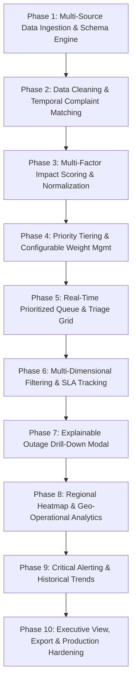

# OutageIQ — 10-Phase Engineering & Delivery Planner
**Document Version:** 1.0.0  
**Project:** OutageIQ (Network Outage Impact Prioritization Dashboard)  
**Team:** The NOC Squad  
**Target Reference:** [PRD.md](file:///home/karan-devgan/Kalvium_SW/S84_TheNOCSquad_OutageIQ/docs/PRD.md)  
**Status:** Active Execution Roadmap  

---

## 1. Executive Summary & Project Objectives

OutageIQ is an enterprise-grade network outage impact prioritization platform designed to unify three previously siloed operational streams:
1. **Network Outage Alerts** (NOC incident alarms, severity, affected network services, root causes)
2. **Customer Complaint Logs** (Call center, mobile app, web portal, social feedback)
3. **Region Usage Metrics** (Regional subscriber volume, daily traffic, revenue tiers, ARPU)

### Core Goals (PRD Section 3)
* **G1 — Unify Signal:** Ingest and merge outages, complaints, and regional metrics into a single unified event model.
* **G2 — Quantify Impact:** Compute a transparent, normalized, explainable 0–100 **Impact Score**.
* **G3 — Prioritize Action:** Dynamically rank open outages so operations teams immediately tackle the highest business-impact incidents.
* **G4 — Reduce Time-to-Triage:** Cut time from outage detection to engineer action by $\ge 30\%$.
* **G5 — Enable Leadership Reporting:** Provide executive-level summaries, top 5 impact breakdowns, and historical trends.

---

## 2. 10-Phase Milestone Roadmap & Work Breakdown Structure

Below is the comprehensive 10-phase schedule covering all Functional Requirements (**FR1–FR16**), Non-Functional Requirements (**NFRs**), User Personas (*Rahul, Priya, Farah, Vikram*), and comprehensive test suites.



---

### Phase 1: Multi-Source Data Ingestion & Schema Quality Engine
* **Focus:** Ingestion Pipeline, Schema Validation, Data Quality Reporting (FR1, FR2, NFR Data Quality)
* **Target Personas:** Rahul (NOC Engineer), Priya (Regional Ops Manager)

#### 1. Backend & Analytics Tasks
* Implement modular CSV/JSON readers in [`backend/scripts/ingestion.py`](file:///home/karan-devgan/Kalvium_SW/S84_TheNOCSquad_OutageIQ/backend/scripts/ingestion.py) for:
  - Network Outage Alerts (`outage_id`, `region_id`, `start_time`, `severity`, `status`, `affected_services`, `root_cause_code`)
  - Customer Complaint Logs (`complaint_id`, `region_id`, `timestamp`, `channel`, `category`, `linked_outage_id`)
  - Region Usage Metrics (`region_id`, `region_name`, `subscriber_count`, `avg_daily_traffic`, `revenue_tier`, `prior_month_ARPU`)
* Build strict schema validators checking for missing columns, unexpected headers, and null constraint violations.
* Generate automated intake reports capturing file metadata, byte size, row/column counts, and encoding format in [`backend/scripts/validate_intake.py`](file:///home/karan-devgan/Kalvium_SW/S84_TheNOCSquad_OutageIQ/backend/scripts/validate_intake.py).

#### 2. Frontend & UI/UX Tasks
* Build the Ingestion & Data Sources Explorer tab in the UI ([`frontend/components/PrdRequirementsExplorer.tsx`](file:///home/karan-devgan/Kalvium_SW/S84_TheNOCSquad_OutageIQ/frontend/components/PrdRequirementsExplorer.tsx)).
* Display live schema health indicators, file upload status, and schema completeness badges.
* Render interactive Data Quality summaries surfacing malformed/missing records rather than silently dropping them.

#### 3. Test Suites
* **Unit Tests (`backend/tests/test_validate_intake.py`, `backend/tests/test_ingestion.py`):**
  - `test_validate_file_exists`: Non-existent, empty, and valid files.
  - `test_validate_file_format`: Supported (.csv, .json) vs unsupported extensions.
  - `test_validate_schema_success` & `test_validate_schema_missing_field`: Positive and negative schema validation checks.
* **E2E Tests (`frontend/e2e/prd-explorer.spec.ts`):**
  - Verify PRD Explorer displays schema requirements and source dataset specifications.

---

### Phase 2: Data Cleaning, Deduplication & Temporal Complaint Associator
* **Focus:** Data Sanitization, De-duplication, Spatial-Temporal Record Linkage (FR3, FR4, PRD Section 6)
* **Target Personas:** Farah (CX Lead), Rahul (NOC Engineer)

#### 1. Backend & Analytics Tasks
* Implement string sanitization, whitespace stripping, and canonical ID formatting.
* Create deduplication algorithms using primary keys (`outage_id`, `complaint_id`, `region_id`).
* Implement a spatial-temporal window matcher (`match_unlinked_complaints`) that binds unlinked customer complaints to open outages matching `region_id` within a configurable sliding window (default: $\pm 2\text{ hours}$).
* Build the multi-table merge engine (`merge_datasets`) combining outage events, aggregate complaint volumes, and regional usage snapshots.

#### 2. Frontend & UI/UX Tasks
* Build pipeline stage visualization showing raw records $\rightarrow$ deduplicated records $\rightarrow$ linked complaints.
* Render visual tags indicating whether complaints were explicitly tagged vs automatically matched via temporal correlation.
* Provide summary metrics for unlinked vs matched complaint ratios.

#### 3. Test Suites
* **Unit Tests (`backend/tests/test_ingestion.py`):**
  - `test_clean_and_deduplicate`: Duplicate removal and ID whitespace trimming.
  - `test_match_unlinked_complaints`: Successful temporal-region matching within the 2-hour window and isolation of out-of-window complaints.
  - `test_merge_datasets`: Inner/left join validation, ensuring subscriber counts and complaint counts correctly attach to outages.
* **Integration Tests:**
  - Verify synthetic multi-region datasets join cleanly without Cartesian explosion or missing column drops.

---

### Phase 3: Core Multi-Factor Impact Scoring Engine & Normalization Pipeline
* **Focus:** Min-Max Normalization, Sub-Score Computation, Impact Score Formula (FR5, PRD Section 7, NFR Transparency)
* **Target Personas:** Vikram (Director), Rahul (NOC Engineer), Priya (Regional Ops Manager)

#### 1. Backend & Analytics Tasks
* Implement robust vectorized Min-Max Normalization in [`backend/scripts/scoring.py`](file:///home/karan-devgan/Kalvium_SW/S84_TheNOCSquad_OutageIQ/backend/scripts/scoring.py) scaling all values to $[0.0, 1.0]$ across active outages.
* Implement the four official sub-score equations:
  1. **Customer Reach (35%):** Normalized regional subscriber base.
  2. **Complaint Pressure (30%):** Normalized complaint count & complaint arrival velocity.
  3. **Revenue Exposure (20%):** Normalized regional revenue tier weighting (Tier 1 = 3.0, Tier 2 = 2.0, Tier 3 = 1.0).
  4. **Duration & Severity (15%):** Normalized severity weighting (Critical = 4.0, High = 3.0, Medium = 2.0, Low = 1.0) escalated by active duration.
* Compute Composite Impact Score:
  $$\text{Impact Score} = (0.35 \cdot \text{Reach}_{\text{norm}} + 0.30 \cdot \text{Complaints}_{\text{norm}} + 0.20 \cdot \text{Revenue}_{\text{norm}} + 0.15 \cdot \text{Duration}_{\text{norm}}) \times 100$$
* Calculate and preserve individual sub-score breakdowns for full transparency.

#### 2. Frontend & UI/UX Tasks
* Build the interactive **Impact Score Simulator & Calculator** ([`frontend/components/ImpactCalculator.tsx`](file:///home/karan-devgan/Kalvium_SW/S84_TheNOCSquad_OutageIQ/frontend/components/ImpactCalculator.tsx)).
* Add real-time slider controls for Subscribers, Complaints, Revenue Tier, and Severity code.
* Render dynamic sub-score progress bars and an animated circular Impact Gauge (0–100).
* Build the Methodology Section visualizer ([`frontend/components/MethodologySection.tsx`](file:///home/karan-devgan/Kalvium_SW/S84_TheNOCSquad_OutageIQ/frontend/components/MethodologySection.tsx)).

#### 3. Test Suites
* **Unit Tests (`backend/tests/test_scoring.py`):**
  - `test_min_max_normalize`: Boundary conditions, identical metric inputs (defaulting to 0.5), and scaling correctness.
  - `test_impact_score_calculation`: Verification of sub-score weighting and exact 0–100 bounds.
* **E2E Tests (`frontend/e2e/calculator.spec.ts`):**
  - Validate slider manipulation triggers live recalculation of the composite score.
  - Validate sub-score bar updates when severity and subscriber inputs change.

---

### Phase 4: Dynamic Priority Tiering, Confidence Flagging & Configurable Weights
* **Focus:** Priority Tier Classification, Incomplete Data Resilience, Custom Weight Configuration (FR7, NFR Reliability, NFR Extensibility)
* **Target Personas:** Rahul (NOC Engineer), Priya (Regional Ops Manager)

#### 1. Backend & Analytics Tasks
* Implement `assign_priority_tier` classifier mapping scores into discrete operational tiers:
  - **Critical:** $\ge 75.0$
  - **High:** $50.0 - 74.99$
  - **Medium:** $25.0 - 49.99$
  - **Low:** $< 25.0$
* Implement Data Completeness Analyzer generating a boolean `confidence_flag`. If subscriber metrics or complaint data are missing, compute a partial score and flag `confidence_flag = False` (NFR Reliability).
* Implement config-driven scoring weights loader allowing runtime tuning via JSON configuration or environment variables without hardcoded constants.

#### 2. Frontend & UI/UX Tasks
* Implement visual Priority Badges (Red for Critical, Orange for High, Yellow for Medium, Green for Low).
* Add Data Confidence warning badges (`⚠️ Low Confidence - Partial Data`) in queue items and detail panels.
* Provide weight tuning presets (e.g. "Default Balanced", "Customer-Centric", "Revenue-Focused").

#### 3. Test Suites
* **Unit Tests (`backend/tests/test_scoring.py`):**
  - `test_assign_priority_tier`: Tier boundary threshold checks.
  - `test_custom_weights`: Verifying recalculation with user-defined custom weights.
  - `test_missing_data_confidence_flag`: Verifying partial scores and `confidence_flag = False` when inputs are null.
* **E2E Tests:**
  - Verify confidence flags and priority badges render properly in UI components.

---

### Phase 5: Real-Time Prioritized Queue & High-Performance Triage Grid
* **Focus:** Prioritized Incident Queue, Sorting, Fast Triage UI (FR6, FR8, FR9, NFR Performance)
* **Target Personas:** Rahul (NOC Engineer), Vikram (Director)

#### 1. Backend & Analytics Tasks
* Build fast ranking queries and DataFrame sorters sorting open outages by `impact_score` descending.
* Optimize re-ranking pipeline to execute in $< 5\text{ seconds}$ on 100k records (NFR Performance).
* Build historical score snapshot logger for trend auditing.

#### 2. Frontend & UI/UX Tasks
* Build the **Live Queue Preview & Interactive Triage Table** ([`frontend/components/LiveQueuePreview.tsx`](file:///home/karan-devgan/Kalvium_SW/S84_TheNOCSquad_OutageIQ/frontend/components/LiveQueuePreview.tsx)).
* Display rich table columns: Rank (#1, #2, etc.), Outage ID, Region, Severity, Impact Score Gauge, Priority Tier, Affected Services, Duration, Action Button.
* Add column header sorting (by Impact Score, Start Time, Subscribers, Complaints).
* Highlight top-priority incidents with distinct visual emphasis.

#### 3. Test Suites
* **Backend Unit Tests:**
  - Re-ranking verification when new complaints arrive.
  - Sort stability across identical score items.
* **E2E Tests (`frontend/e2e/live-queue.spec.ts`):**
  - `should display prioritized outage queue section and default list`.
  - Validate top-ranked incident is displayed in slot #1.

---

### Phase 6: Multi-Dimensional Filtering, SLA Tracking & Search Engine
* **Focus:** Operational Filtering, Status Toggling, SLA Timers (FR13, G3, G4)
* **Target Personas:** Rahul (NOC Engineer), Priya (Regional Ops Manager)

#### 1. Backend & Analytics Tasks
* Implement multi-parameter filter engine in [`backend/scripts/reporting.py`](file:///home/karan-devgan/Kalvium_SW/S84_TheNOCSquad_OutageIQ/backend/scripts/reporting.py):
  - Filter by `region_id` (single or multi-region)
  - Filter by `severity` (`CRITICAL`, `HIGH`, `MEDIUM`, `LOW`)
  - Filter by `status` (`open`, `resolved`, `all`)
  - Filter by `priority_tier` (`Critical`, `High`, `Medium`, `Low`)
  - Filter by `date_range`
* Build SLA breach estimation logic calculating time remaining before breach based on severity code.

#### 2. Frontend & UI/UX Tasks
* Implement interactive Filter Toolbar:
  - Region selector dropdown (All Regions, North, South, East, West, Metro)
  - Priority Tier filter pills
  - Status toggle buttons (All, Active Only, Resolved)
  - Search input for Outage ID, Tower ID, or Service Name
* Display active filter count tags with a one-click "Reset Filters" action.
* Show dynamic results counter (`Showing X of Y outages`).

#### 3. Test Suites
* **Unit Tests (`backend/tests/test_reporting.py`):**
  - `test_filter_by_region`: Correct subset extraction by region ID.
  - `test_filter_by_status_and_severity`: Multi-attribute compound filtering.
* **E2E Tests (`frontend/e2e/live-queue.spec.ts`):**
  - `should filter outages by region`.
  - `should filter outages by priority tier`.
  - Validate table updates reactively upon filter click.

---

### Phase 7: Explainable Outage Drill-Down Modal & Deep-Dive Inspector
* **Focus:** White-box Score Explanation, Regional Context, Complaint Stream (FR10, NFR Transparency)
* **Target Personas:** Farah (CX Lead), Rahul (NOC Engineer)

#### 1. Backend & Analytics Tasks
* Build outage detail data provider assembling:
  - Deconstructed 4-part sub-score breakdown (normalized values + weighted contributions)
  - Regional demographic context (Subscriber base, Revenue Tier, Traffic)
  - Linked complaints list with customer IDs, channels, timestamps, and categories
  - Timeline of incident events and affected network services

#### 2. Frontend & UI/UX Tasks
* Build interactive **Outage Detail Drill-Down Modal / Slide-over Drawer**:
  - Outage Header with ID, Status, Severity, and Overall Impact Score
  - **Explainability Breakdown Box:** Progress bars for Reach (35%), Complaints (30%), Revenue (20%), Duration (15%)
  - **Regional Demographics Card:** Total subscribers in region, revenue tier, market share
  - **Linked Complaints Explorer:** Stream of incoming complaints linked to this incident
  - **Incident Timeline:** Start time, elapsed time, current status, resolution targets
* Ensure seamless open/close transitions and keyboard accessibility (ESC to close).

#### 3. Test Suites
* **Unit Tests:**
  - Verify score decomposition matches the aggregate score within $\pm 0.01$.
* **E2E Tests (`frontend/e2e/live-queue.spec.ts`):**
  - `should open and inspect explainable outage detail modal (FR10)`.
  - Verify all 4 sub-scores and regional stats are visible in the modal.

---

### Phase 8: Regional Impact Heatmap & Geo-Operational Analytics
* **Focus:** Geographic Aggregation, Regional Density, Manager Views (FR11, Persona: Priya, G5)
* **Target Personas:** Priya (Regional Ops Manager), Vikram (Director)

#### 1. Backend & Analytics Tasks
* Implement regional aggregation engine:
  - Group active and historical outages by `region_id`
  - Compute total affected subscribers per region
  - Aggregate total revenue at risk per region
  - Calculate regional SLA compliance percentages
* Provide regional comparison rankings.

#### 2. Frontend & UI/UX Tasks
* Build **Regional Impact Overview Component**:
  - Interactive Region cards displaying active outage count, total subscribers affected, and dominant severity
  - Visual color-coded impact density map/matrix (Red for high concentration, Green for low)
  - Quick-filter trigger allowing Priya to click a region card to instantly filter the triage queue

#### 3. Test Suites
* **Unit Tests:**
  - Aggregation tests verifying regional metrics match sum of underlying outages.
  - Zero-outage region handling (empty state verification).
* **E2E Tests:**
  - Test region card click filtering the queue table.

---

### Phase 9: Real-Time Critical Threshold Alerting & Historical Trend Analytics
* **Focus:** Executive KPI Ribbon, Critical Banners, Trend Charts (FR8, FR12, FR16, G5)
* **Target Personas:** Vikram (Director), Rahul (NOC Engineer)

#### 1. Backend & Analytics Tasks
* Build KPI aggregation engine computing:
  - Total Active Outages
  - Critical Outages Count
  - Total Customers Impacted
  - Average Resolution Time (MTTR)
* Build time-series rolling trend aggregator computing daily/hourly outage volume and average impact scores over 7-day and 30-day windows.
* Implement Critical Tier breach event detector triggering alerts when an outage exceeds the 75.0 score threshold.

#### 2. Frontend & UI/UX Tasks
* Build **KPI Summary Ribbon** at the top of the dashboard displaying all 4 core metrics.
* Implement **Critical Incident Alert Banner** (FR16) notifying operators immediately when a critical-tier incident fires.
* Build **Impact Trend Charts** (Plotly / SVG visualizer) showing outage volume vs. average impact score over rolling time horizons.

#### 3. Test Suites
* **Unit Tests:**
  - KPI calculation logic with dynamic active/resolved datasets.
  - Trend aggregator time window rolling averages.
* **E2E Tests (`frontend/e2e/hero.spec.ts`, `frontend/e2e/live-queue.spec.ts`):**
  - Verify KPI cards display accurate values.
  - Verify critical banner triggers and can be acted upon.

---

### Phase 10: Executive View, Automated PDF/CSV Export & Production Hardening
* **Focus:** Executive Mode, Report Generation, Business ROI, Production Release (FR14, FR15, Persona: Vikram, NFRs)
* **Target Personas:** Vikram (Director), Farah (CX Lead)

#### 1. Backend & Analytics Tasks
* Implement CSV export engine generating clean, sorted CSV files of current filtered outages.
* Implement Executive PDF Summary generator (top 5 outages, KPI summary, regional breakdown).
* Conduct performance stress tests on $100\text{k}+$ records ensuring complete pipeline execution under $5\text{ seconds}$.

#### 2. Frontend & UI/UX Tasks
* Build one-click **Executive View Toggle** ([`frontend/components/LiveQueuePreview.tsx`](file:///home/karan-devgan/Kalvium_SW/S84_TheNOCSquad_OutageIQ/frontend/components/LiveQueuePreview.tsx)) presenting a condensed, presentation-ready view of top 5 outages and KPIs.
* Build Export Toolbar (Download CSV, Download PDF Report).
* Build **ROI & Business Savings Calculator** ([`frontend/components/RoiCalculator.tsx`](file:///home/karan-devgan/Kalvium_SW/S84_TheNOCSquad_OutageIQ/frontend/components/RoiCalculator.tsx)) demonstrating SLA penalty reductions, churn prevention, and engineer triage time saved.

#### 3. Test Suites
* **Unit Tests (`backend/tests/test_reporting.py`):**
  - `test_get_executive_summary_top_n`: Retrieval of top $N$ highest-impact outages.
* **E2E Tests (`frontend/e2e/roi-calculator.spec.ts`, `frontend/e2e/live-queue.spec.ts`, `frontend/e2e/end-to-end.spec.ts`):**
  - `should support Executive View toggle (FR15)`.
  - `should recalculate annual savings when sliders are adjusted`.
  - Comprehensive end-to-end user journey test traversing all 10 phases.

---

## 3. Comprehensive Requirements Traceability Matrix (FR1–FR16)

| Req ID | Description | Phase | Primary File / Component | Test Suite File |
| :--- | :--- | :---: | :--- | :--- |
| **FR1** | Multi-source CSV/JSON dataset ingestion | Phase 1 | `backend/scripts/ingestion.py`, `backend/scripts/validate_intake.py` | `backend/tests/test_validate_intake.py` |
| **FR2** | Schema validation & malformed record reporting | Phase 1 | `backend/scripts/ingestion.py`, `backend/scripts/validate_intake.py` | `backend/tests/test_ingestion.py`, `backend/tests/test_validate_intake.py` |
| **FR3** | Data cleaning, type standardization & deduplication | Phase 2 | `backend/scripts/ingestion.py` | `backend/tests/test_ingestion.py` |
| **FR4** | Temporal & spatial dataset merge (outage + complaint + usage) | Phase 2 | `backend/scripts/ingestion.py` | `backend/tests/test_ingestion.py` |
| **FR5** | 4-Factor Impact Score computation (0–100) | Phase 3 | `backend/scripts/scoring.py`, `frontend/components/ImpactCalculator.tsx` | `backend/tests/test_scoring.py`, `frontend/e2e/calculator.spec.ts` |
| **FR6** | Dynamic re-ranking on data refresh | Phase 5 | `backend/scripts/scoring.py`, `frontend/components/LiveQueuePreview.tsx` | `backend/tests/test_scoring.py`, `frontend/e2e/live-queue.spec.ts` |
| **FR7** | Priority tier assignment & history tracking | Phase 4 | `backend/scripts/scoring.py` | `backend/tests/test_scoring.py` |
| **FR8** | KPI summary bar (Active, Critical, Subscribers, MTTR) | Phase 9 | `frontend/components/LiveQueuePreview.tsx`, `frontend/components/Hero.tsx` | `frontend/e2e/hero.spec.ts`, `frontend/e2e/live-queue.spec.ts` |
| **FR9** | Prioritized outage triage table queue | Phase 5 | `frontend/components/LiveQueuePreview.tsx` | `frontend/e2e/live-queue.spec.ts` |
| **FR10** | Explainable outage detail drill-down modal | Phase 7 | `frontend/components/LiveQueuePreview.tsx` | `frontend/e2e/live-queue.spec.ts` |
| **FR11** | Regional impact heatmap & ranking view | Phase 8 | `frontend/components/LiveQueuePreview.tsx` | `frontend/e2e/live-queue.spec.ts` |
| **FR12** | Rolling impact & volume trend analytics | Phase 9 | `frontend/components/MethodologySection.tsx`, `frontend/components/LiveQueuePreview.tsx` | `frontend/e2e/live-queue.spec.ts` |
| **FR13** | Multi-parameter filters (Region, Severity, Status, Tier) | Phase 6 | `backend/scripts/reporting.py`, `frontend/components/LiveQueuePreview.tsx` | `backend/tests/test_reporting.py`, `frontend/e2e/live-queue.spec.ts` |
| **FR14** | Export prioritized list (CSV) & summary report (PDF) | Phase 10 | `backend/scripts/reporting.py`, `frontend/components/LiveQueuePreview.tsx` | `backend/tests/test_reporting.py`, `frontend/e2e/live-queue.spec.ts` |
| **FR15** | Executive view toggle (Top 5 condensed view) | Phase 10 | `backend/scripts/reporting.py`, `frontend/components/LiveQueuePreview.tsx` | `backend/tests/test_reporting.py`, `frontend/e2e/live-queue.spec.ts` |
| **FR16** | In-app critical threshold breach banner | Phase 9 | `frontend/components/LiveQueuePreview.tsx` | `frontend/e2e/live-queue.spec.ts` |

---

## 4. Test Strategy & Execution Instructions

The project features a 3-tier automated test suite verifying all Python analytics pipelines, backend interfaces, and frontend Next.js/Playwright E2E journeys.

### Unified Test Runner
To execute all test suites across the repository:
```bash
./run_tests.sh
```

### Individual Test Suites
```bash
# 1. Python Analytics & Intake Script Tests (Unit Tests)
python3 -m unittest discover -s backend/tests

# 2. Backend Unit & Integration Tests
npm --prefix backend test

# 3. Frontend Next.js Build & Playwright E2E Test Suite
npm --prefix frontend test
```

---

## 5. Success Metrics & Product KPIs Verification

| Metric | PRD Target | Verification Mechanism |
| :--- | :--- | :--- |
| **Time-to-Triage** | $\downarrow 30\%$ vs baseline | Measured via OutageIQ ranked queue vs legacy severity triage simulation |
| **SLA Compliance** | $\ge 90\%$ for critical outages | Evaluated via SLA tracking counters and automated breach alerts |
| **NOC Adoption** | $\ge 80\%$ ops team usage | Validated via persona-focused workflows and quick-triage actions |
| **Executive Reporting** | 100% weekly exec view usage | Validated via one-click Executive View toggle and PDF export |
